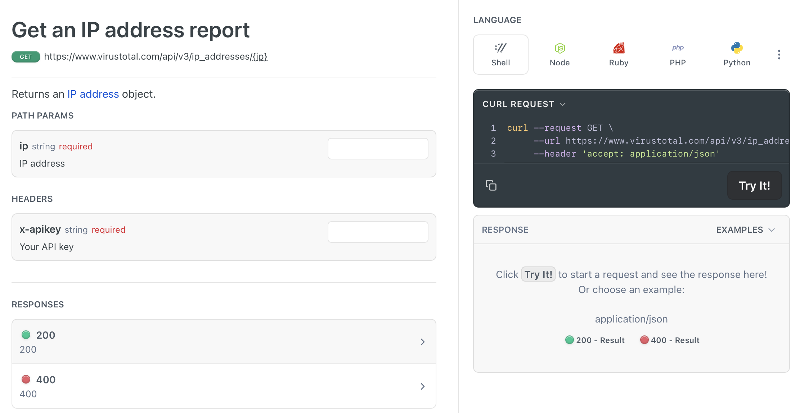
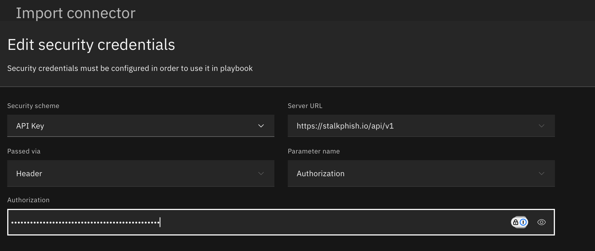

# OpenAPIBuilder
Many data services with exposed APIs document their interfaces using the popular Swagger development tools. This effort has led to the OpenAPI Specification and is widely used to define API endpoints, their required parameters, and expected results. However, many solutions do not publish this document, and writing an OpenAPI document 'from scratch' to interface with these solutions is complex for the newly initiated. There's a lot of terminology and context which can be challenging to navigate and time consuming to master.

This tool is intended to simplify that effort, guiding the user through the process of generating an OpenAPI Specification document and verifying its correctness. 
It uses an iterative approach to collecting information about a service's API endpoints and assembles them into an OpenAPI specification document.
This tool was written to quickly import *connectors* for IBM QRadar SOAR's low code initiative when existing OpenAPI Specification documents are unavailable. However, it remains general purpose for any environment which consumes OpenAPI documents, such as Postman, Azure, AWS, Apidog, etc. 

## Overview

### Revision History
| Version | Date | Notes |
| ------- | ---- | ----- |
| 1.0.0   | 3/2024 | Initial Release |

### Requirements
This tool is written in Python. Version 3.9 and above is required. Several Python packages are used, and Internet access is required during the installation process to collect the following packages:
* jsonschema_to_openapi
* openapi_schema_validator
* json2schema
* pyyaml

### Installation
The tool is installed from its source code.
Navigate to the `openapi_builder` directory and run `pip install .` or produce the distribution file by running `python3 -m build .`. This command produces .tar.gz and .whl files which can be later installed using the `pip` command. For example `pip install openapibuilder-1.0.0-py3-none-any.whl`.

```
git clone https://github.com/ibmresilient/resilient-python-api.git
cd openapi_builder
python3 -m build .
# change x.x.x to the version number referenced from the build step
pip install dist/openapibuilder-x.x.x-py3-none-any.whl
```

### Uninstall
Run `pip uninstall OpenAPIBuilder` to remove the tool from your environment.

## Terminology
In order to use the OpenAPIBuilder tool, a few terms would be helpful to understand when building an OpenAPI Specification document. 
Consider the following fictitious cURL command to make an API call to update an existing request: 123:
```
curl -X PUT -h "X-API-KEY: aaa-bbb-ccc***" -h "Content-Type: application/json" -d '{"verified": true, "status": "Active"}' "https://server.com/api/v1/request/123?pretty=1&format=json"
```
### Path Methods
All API calls use HTTP `methods` for URL execution: GET, PUT, POST, DELETE, PATCH, etc. 
URL paths (ex. /request/123) can support more than one `method`. This above example call uses 'PUT' for update operations. 
### Authentication
Most APIs endpoints have some form of `authentication`. This URL uses an `API Token` which is specified as a HTTP `header`: 'X-API-KEY'. The API Token may be derived (such as a session token) or generated once by the data service. 
### Servers
The `Server URL` is the base URL which is shared by the `path` of multiple API calls. In this case, the server URL is `https://server.com/api/v1`. More than one may exist for a given set of API calls.
### Paths
For the URL 'https://server.com/api/v1/request/123', the `API Path` is `/request/123`. The `123` portion of the path is subject to change and a placeholder `path parameter` is used to allow that value to change. Therefore this `path` will be specified as `/request/{id}` where `id` represents a request Id. Path parameters are always required and more than one may exist in a path.

### Query Parameters
Query parameters are the portion of the URL after '?'. Two are specified as `pretty` and `format`. It should be noted that these parameters have a defined format, such as 'string', 'integer', 'number', 'array', and 'boolean'. In this case, the `pretty` value will be an `integer` and `format` will be a `string`. Query parameters can also be specified as either `required` or `optional` when the URL is assembled.

### Request Body
Additional form-based data can be specified and are most frequently found on `PUT` and `POST` method calls. This PUT API call updates two request fields: `verify` and `status`. JSON format is used to describe this data, and this example can be used to define sample data within OpenAPIBuilder.
Request bodies are formatted, and that format is specified by the `Content-Type` header. 

### Responses
Once the API call is made, a response is returned. 
Responses are specific to the HTTP status code returned, ex. 200 for a successful API call. 
Responses are also formatted and OpenAPIBuilder will prompt for that format.
More than one response can be defined for each `path` and this information is used in IBM QRadar SOAR to help navigate the response for post-processing the results.

## Getting Started
In order to start using OpenAPIBuilder to produce an OpenAPI Specification document or a `connector` for IBM QRadar SOAR, it's best to start with a data service's API documentation. If that service already defines an OpenAPI document to download, use that. Otherwise, reference the API calls to include in the OpenAPIBuilder document. 
In the following screenshot, VirusTotal documents all the information needed to create an OpenAPIBuilder document to investigate an IP address. See (https://docs.virustotal.com/reference/ip-info). 



Separating the information needed for OpenAPIBuilder:

* API documentation reference: https://docs.virustotal.com/reference/ip-info
* Server URL: https://www.virustotal.com/api/v3
* Authentication: API Token, x-apikey
* Path: /ip_address/{ip}
* Path method: GET
* Path parameter: ip (string)
* Responses: 200, 400 (no further detail is defined, which is OK)

## Use
Run `OpenAPIBuilder` to create a new specification file. Editing an existing specification file is optional to continue adding servers, tags, headers, paths, etc.
```
% OpenAPIBuilder -h
usage: OpenAPIBuilder [-h] [-v VERSION] [-s] [-t] [file]

positional arguments:
  file                  Optional existing OpenAPI spec file to enhance (json or yaml format supported)

optional arguments:
  -h, --help            show this help message and exit
  -v VERSION, --version VERSION
                        Document version of OpenAPI specification to use. Default 3.0.0
  -s, --soar            Added prompts for use with IBM's SOAR low-code connectorsReduces explanation of prompts
```

The tool is organized in sections, identified by '>>>'. Each section starts with an overview explanation followed by repeating prompts, identified with a '*'. Data input errors are identified with '***'.
For example, the section for Server URLs looks like this:

```
>>> Servers
The next section prompts for the base URL(s) for the API service.
Additional sections will prompt for the API endpoint paths.

* Enter a server URL. (Return/Enter skips input)
Ex: https://myserver/api/v1: 
*** Define at least one server URL.

* Enter a server URL. Multiple servers may be entered, separated by commas. (Return/Enter skips input)
Ex: https://myserver/api/v1: https://www.virustotal.com/api/v3

* Enter another server URL. (Return/Enter skips input)
Ex: https://myserver/api/v1:
```

Each section ends by typing an empty line prompted by: `(Return/Enter skips input)`

Paths are the most complex part of OpenAPIBuilder. A path can encompass all these parts:
* server URL
* path parameters
* query parameters
* headers
* request body
* responses
* tags

Where possible, the path prompts will include breadcrumbs to help keep track of the referenced data. In the following example, the path label `put_request_id` and query parameter `pretty` is referenced to associate the three prompts together:

```
* (put_request_id) Enter a query parameter for '/t1'.
Enter Input (Return/Enter skips input): pretty

(put_request_id:pretty) Enter parameter type. *required*
Choices: 
1) string, 
2) integer, 
3) number, 
4) boolean, 
5) array, 
6) object
Enter Choice: 2

(put_request_id:pretty) Enter required parameter use. *required*
Choices: 
1) True, 
2) False
Enter Choice: 1

(put_request_id:pretty) Enter description.
Enter Input (Return/Enter skips input): 
```

### Editing an existing OpenAPI document
To edit an existing OpenAPI document, refer to it when invoking the tool: `OpenAPIBuilder virustotal.json`. 

If it passes validation, the same set of prompts will be presented to collect Server URLs, headers, authentication, etc. When existing section data is found, the tool will present the existing information so it need not be duplicated.

```
>>> API Paths
Let's define the API endpoints. Each endpoint will be a portion of the URL appended to the server URL.
Additional information collected will include the API call method and any API input parameters. Ex: get, put, get, delete

Existing API endpoints
  /info.php (get)
```

## Notes

1. OpenAPI Specification documents are versioned with both the document version (starting with 1.0.0), and which version of the OpenAPI Specification used. IBM QRadar SOAR version 51.0.5 uses OpenAPI Specification version 3.0.0.
Version 3.1.0 formatted documents are built using the optional `-v or --version` command line parameter.

2. To interrupt the tool, enter `ctl-C`. You will be prompted to save your progress or just exit.

3. Editing an existing endpoint path is possible, but only to replacement it. In this case, when a duplicate path is found (combination of API path and method), you will be prompted to continue with the replacement or skip: 

```
>>> API Paths
Let's define the API endpoints. Each endpoint will be a portion of the URL appended to the server URL.
Additional information collected will include the API call method and any API input parameters.

Existing API endpoints
  /info.php (get)

* Enter another API endpoint path starting with '/'.
Include any query parameters if present. Prompts will follow to enter additional query parameters separately. (Return/Enter skips input)
Ex: /threats/{threatId}?deep=true: /info.php

Enter a description helpful to understand the functionality of this API call (Return/Enter skips input): 

Enter the HTTP method. *required*
Choices: 
1) GET, 
2) PUT, 
3) POST, 
4) DELETE, 
5) PATCH
Enter Choice: 1

This endpoint already exists: /info.php (get). Continue to overwrite? *required*
Choices: 
1) Yes,
2) No
Enter Choice: 1
```

4. If you require Bearer authorization using a different token, for instance 'Token' rather than 'Bearer', this can be defined as follows. 
When choosing the authentication type, select 'API Token' rather than 'Bearer Token'. Then, name the header key as `Authorization`.

```
>>> Authentication

Define the authentication method used. *required*
Choices: 
1) Basic Authentication, 
2) Bearer Token, 
3) API Token, 
4) None/Other
Enter Choice: 3

Define the location of the API key. *required*
Choices: 
1) query, 
2) header
Default: header 
Enter Choice: (Return/Enter selects the default): 

Define the header setting that will contain the API key. *required*
Ex: X-API-Key: Authorization   
```
Then, when importing the OpenAPI specification document into IBM QRadar SOAR and configuring the connector's security credentials, type the new token followed by the API key. For instance: "Token a1b2c3". Changing the UI make the display visible is the best way to ensure correct data entry.



5. Specifying OAuth security authentication is currently not possible.

### IBM QRadar SOAR Specific
1. In a playbook, path parameters (ex. /v2/search/{search_id}) must be static or derived from a SOAR object such as an incident or an artifact (ex. artifact.value). 
Dynamic values produced within the playbook (such as from a previous function call) are not yet accessible for parameters.

## Troubleshooting
For IBM customers, questions on use and issues can be asked in the [community forum](https://ibm.biz/soarcommunity). Other issues can be addressed within [Github source code]().

## References
1. [OpenAPI Specification](https://swagger.io/specification/)
2. [IBM QRadar SOAR Documentation](https://ibm.biz/soar-docs)

## Futures
Presently, the tool generates a JSON representation of the OpenAPI specification file. Future releases will allow both JSON and YAML file generation. Also, it will be easier to revisit different sections of a document rather than just visiting each section sequentially.
