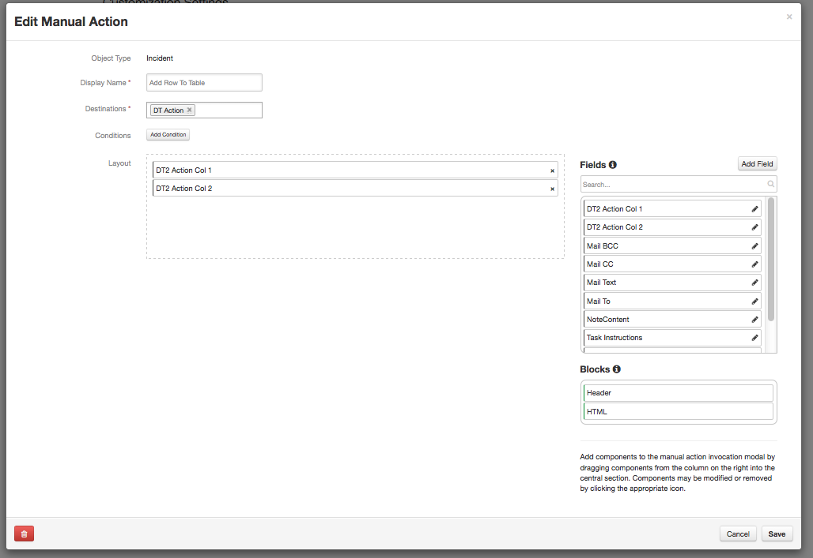
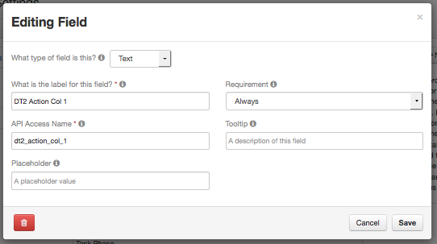
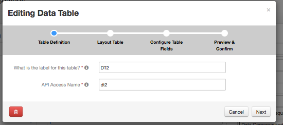
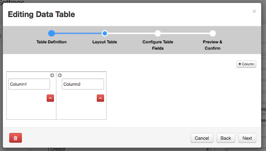
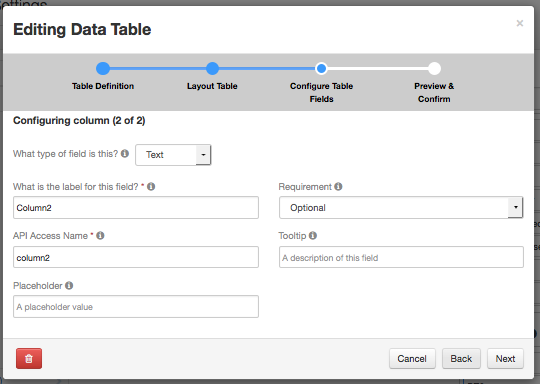
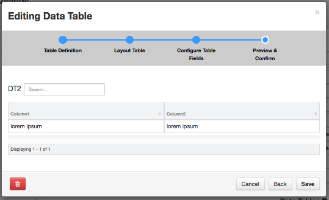

# Add to Table Action
Manual action processor which takes values from the action form and creates a row in the specified
table with those values

## Configuration
Within the configuration file, the following sections contain configuration specific to this 
action processor.

### actiondata
Configuration information for the action.  
+ tabletoadd=&lt;apiname of the table to add a row to&gt;
+ rowmap=&lt;path to file mapping action field api mame to resilient table cell api name&gt;

## Row Mapping
Simple json structure of the action field api name to the table column
```
{
"action_api_name":"table column api name"
...
"action_api_name":"table column api name"
}
```


## Resilient Configuration
The default configuration expects an action queue named *dt_action*, and a manual action defined as
*add_row_to_table* with two fields (*dt2_action_col_1*,*dt2_action_col_2*).  A table of *dt2*  with two cells defined (*column1*,*column2*).
### Messaged Destination 

### Manual Action

#### Manual Action Fields


### Table Definitions






