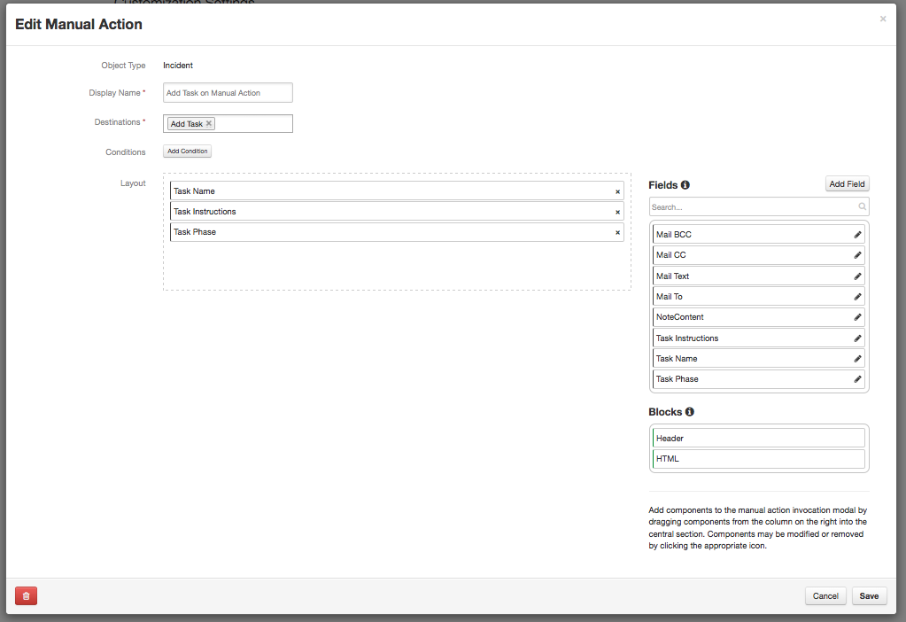
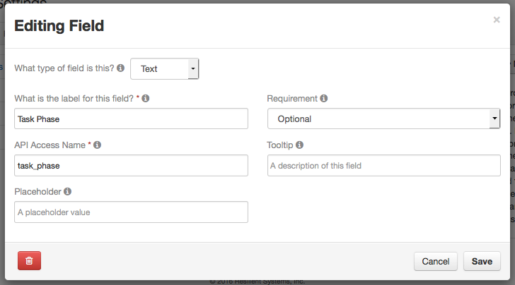

# Action handler for adding a task to the incident
Expects three action fields to be defined.  *Task Instructions* as a Text Area, *Task Name* as a Text field, and
*Task Phase* as a Text field.

The user is expected to type the phase in correctly (a production implementation would create a select field and
put the configurations phases into the field, however since this is generic and can run against any organization 
definition, manual entry is chosen)

## Execution
```
python taskadd.py
```

## Configuration
The configuration is contained within *app.config*, to change which configuration file is loaded specify in the *APP_CONFIG_FILE* environment variable the full path to the filename e.g.
```
export APP_CONFIG_FILE=/home/user/configuration.file
```
The example configuration file is kept in *Config/app.config*, and the *runit* shell script sets the environment

The configuration file is broken into sections as follows
### resilient
Connection information to the source org (used by the resilient_circuits module to connect to the source)
+ host = the hostname of the resilient server
+ port = 443 (always port 443)
+ email = Resilient user login (be sure that this user is not a SAML or Two Factor user, it also needs to have MasterAdministrator privileges in order to map enumerated field values)
+ password = the password for the resilient user
+ org = the name of the resilient org that will be the source of the record
+ stomp_port = 65001 (always 65001) Port for connecting to the Queue for the action module
+ logdir= fully qualified or relative path to the directory for the log file (app.log)
+ cafile= path to the file for the certificate for verification (used if a self signed certificate is used, or if the CA is not in your systems accepted CA list)
+ logfile= filename - defaults to app.log

### action
The destination queue for the action.  
+ queue= queue name configured in resilient


## Resilient Configuration
The default configuration expects an action queue named *add_task*, and a manual action for an incident named 
*Add Task on Manual Action*. Three fields as noted before are expected 
### Messaged Destination 

### Manual Action

### Action Fields definition



