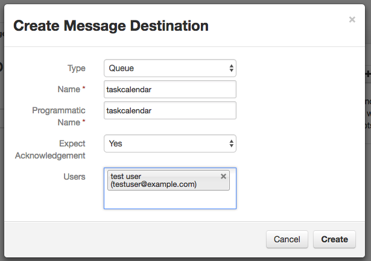
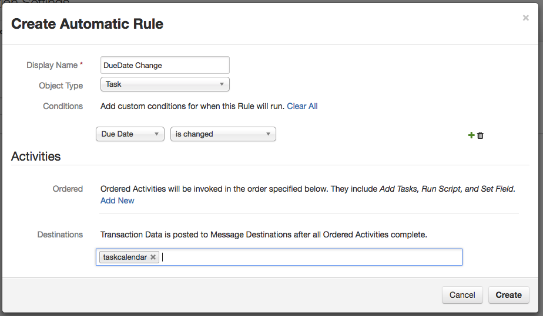

Email calendar entry for task due dates
===================================

Use Case:   Tasks have due dates.  This custom action processor creates a .ics file with the due date for the task
and emails the file to the owner of the task.  If the task does not have a due date, or there is not an owner, no action is taken.
When the task does not have a due date, the event is created as a single day event.

This integration can be run on the Resilient appliance or anywhere else.  
The code is written in Python, and can be extended for your own purposes.

Requires: Python version 2.7.x or 3.4.x or later.
Requires: Resilient Server or hosted Application, version 27 or later.

## Resilient server setup

You must configure the following customizations to the Resilient server.
Open the Customization Settings menu, then:

### Message Destination
Open the Message Destinations tab.
Create a Queue message destination with programmatic name `taskcalendar`.
Select Yes for "expect acknowledgement", and add the integration user
to its users list.

### Automatic Rules
Open the Rules tab.
Create two automatic rules named 'taskcalendar' and 'DueDate change', associated with object type
"Task".  Choose `taskcalendar` as the message destination. 

For the rul 'taskcalendar' add condition
"Owner is changed"

For the rule 'DueDate change' add condition
"Due Date is changed"

## Python setup

The Resilient REST API is accessed with a helper module 'co3' that should be
used for all Python client applications.  The 'co3' module is a part of the
Resilient REST API utilities 'co3-api'.  Download and install that first,
following its instructions.

This application is built using the circuits library.  The 'resilient-circuits'
framework should be downloaded and installed, following its instructions.

#### Installing the Integration

Unpack the integration's files into the location where you will run them. The generic run.py script that is used for all circuits integrations can be found in the main examples directory.
The resilient api, and resilient-circuits modules are also required, referr to the documentation for each of these modules.
Create the `logs` directory that the log file will be written to

## Configuring the Integration

The script reads configuration parameters from a file.
The configuration file is named `app.config`, in the same
directory as the scripts.  Edit this file to provide appropriate values
appropriate for your environment (server URL and authentication credentials).
Verify that the logging directory has been created. To set a different configuration file
set the environment variable 'APP_CONFIG_FILE' to the file you intend to use.

There are two sections to the configuration file.  The 'resilient' section configures the parameters
for accessing the resilient server via the api.  The 'taskcalendar' section configures the action component.
Within the 'taskcalendar' section the following information is required:
* queue - this should be 'taskcalendar' 
* smtpserver - the server which will send the email with the .ics file as an attachment
* smtpfrom - the email address which the email should be shown as from
* smtpuser - login credential for the user on the smtp server. Usually an email address
* smtppw - password for the 'smtpuser' on the smtp server
* smtpport - port on the smtp server.
* use_start_tls - Only include and set to True if using TLS, usually with port 587
* use_ssl - Only include and set to True if using legacy SMTP over SSL, usually with port 465

### Certificates

If your Resilient server uses a self-signed TLS certificate, or some
other certificate that is not automatically trusted by your machine,
you need to tell the Python scripts that it should be trusted.
To do this, download the server's TLS certificate into a file,
e.g. from 'resilient.example.com' to a file 'cert.cer':

    mkdir -p ~/resilient/
    openssl s_client -connect resilient.example.com:443 -showcerts < /dev/null 2> /dev/null | openssl x509 -outform PEM > ~/resilient/cert.cer

Then specify the path to this certificate in the config file.

## Running the example

In the script directory, run the custom action application with:

    python run.py

The script will start running, and wait for messages.  When a task is assigned to a user, or when the due date of the task is changed, the
action processor will be invoked.  If the task only has an owner assigned, then the event is considered a single day event. If there is a due date, then the event is created as a multi day event starting with the current day and ending on the due date.  If the due date is changed, a new event is sent, which will replace the original event in the calendar.  If the owner is changed, the new owner will get the invite.  The previous owner will NOT get an update to remove the event from the calendar.

To stop the script running, interrupt it with `Ctrl+C`.

### Limitations

* Some calendar applications will not display the embedded url
* Updating an existing calendar event may not work properly depending on the calendar application you are using
* If you update the Task's owner and due date at the same time in Resilient, the result will be 2 separate identical calendar invites being sent out.

### More
For more extensive integrations with the actions module contact
[success@resilientsystems.com](success@resilientsystems.com).
