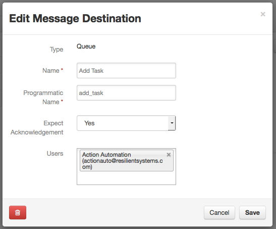
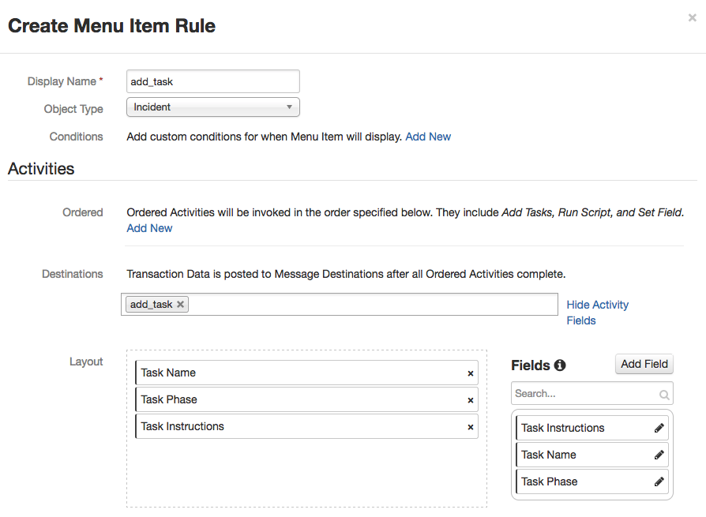

Add a task to a Resilient Incident
===================================

Use Case:  A manual action to create a configurable task on an incident

This integration can be run on the Resilient appliance or anywhere else.  
The code is written in Python, and can be extended for your own purposes.

Requires: Python version 2.7.x or 3.4.x or later.
Requires: Resilient Server or hosted Application, version 27 or later.

## Resilient server setup

You must configure the following customizations to the Resilient server.
Open the Customization Settings menu, then:

### Message Destination
Open the Message Destinations tab.
Create a Queue message destination with programmatic name `add_task`.
Select Yes for "expect acknowledgement", and add the integration user
to its users list.




### Menu Item Rule
Create a Menu Item Rule named 'add_task', associated with object type "Incident".
Choose `add_task` as the message destination.

Several Activity Fields need to be created and added to the rule.
* `Text field` called "Task Name"
* `Text area field` called "Task Instructions"
* `Select field` called "Task Phase", whose options match your organizations's defined incident phases.




## Python setup

The Resilient REST API is accessed with a helper module 'co3' that should be
used for all Python client applications.  The 'co3' module is a part of the
Resilient REST API utilities 'co3-api'.  Download and install that first,
following its instructions.

This application is built using the circuits library.  The 'resilient-circuits'
framework should be downloaded and installed, following its instructions.

## Building the Integration
```
python setup.py sdist --formats=gztar
```

## Testing the Integration
The pytest\_resilient\_circuits package should be downloaded and installed, following its instructions.

# NOTE: These tests _WILL_ remove all configuration from your Resilient org.  Please ensure that the org they are run against is specifically for testing integrations and does not have any data you want retained.

To run tests for this integration in your current python environment:
```
python setup.py test -a "--resilient_email api_user@example.com --resilient_password MyPassword --resilient_host resilient --resilient_org \"Test Org\""
```

To run tests for this integration in all supported python versions with generated virtual environments, 
copy the co3, resilient-circuits, and pytest\resilient\_circuits packages to the taskadd directory and do:
```
pip install virtualenv
pip install tox
tox --  -a "--resilient_email api_user@example.com --resilient_password MyPassword --resilient_host resilient --resilient_org 'Test Org'"
```

## Installing the Integration

Install the integration with pip:
```
pip install dist/taskadd-27-0.0.tar.gz
```

## Configuring the Integration
The script reads configuration parameters from a file.
This file can be generated by running:
```
resilient-circuits config -c app.config
```
Edit this file to provide appropriate values
appropriate for your environment (server URL and authentication credentials).
Verify that the logging directory has been created.

If you already have other integrations installed and want to update your config
file to include settings for this integration, run:
```
resilient-circuits config -u app.config
```

### Certificates

If your Resilient server uses a self-signed TLS certificate, or some
other certificate that is not automatically trusted by your machine,
you need to tell the Python scripts that it should be trusted.
To do this, download the server's TLS certificate into a file,
e.g. from 'resilient.example.com' to a file 'cert.cer':

    mkdir -p ~/resilient/
    openssl s_client -connect resilient.example.com:443 -showcerts < /dev/null 2> /dev/null | openssl x509 -outform PEM > ~/resilient/cert.cer

Then specify the path to this certificate in the config file.


## Running the example
From the same directory as your app.config file, run the integration with:

    resilient-circuits run

The script will start running, and wait for messages.  When users in Resilient
select the 'Add Task' action from the Actions dropdown, a new task will be added
to the incident.


To stop the script running, interrupt it with `Ctrl+C` or kill the process.

## Extending the example

### Pre-configured tasks
Rather than a single "add task" action with user-entered instructions, you could
define a number of tasks with pre-configured instructions available to be
added via manual action.

### Automatically add tasks
This could be adjusted to be an automatic action to add pre-configured tasks
based on whatever trigger conditions are applicable.  For example, add a
specified task whenever a certain custom field is changed.

### More
For more extensive integrations with tasks, contact
[success@resilientsystems.com](success@resilientsystems.com).
