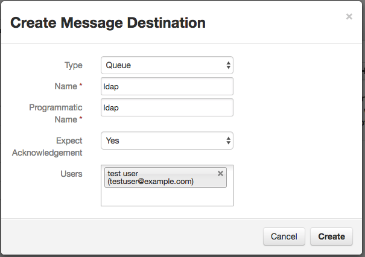
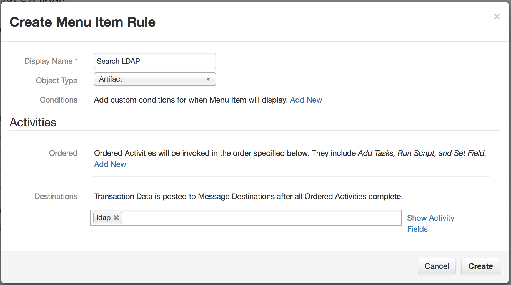

# LDAP Search

This example demonstrates using the Action Module to search an LDAP
directory service to obtain information about artifacts such as user
accounts and system names.

The LDAP results are written to the description of the artifact.

## Setup

Set up the custom action:

* Open the Administrator Settings page, then select the Actions tab
* Add a message destination, type Queue, with programmatic name `ldap`,
  and add the API user to the queue's user list.

  

* Create a Manual Action, "Search LDAP".  Set the object type to Artifact.
  Add the queue `ldap` to the action's destinations.

  

### Running the example

Edit the `ldap.config` file with parameters appropriate to your environment:

* The hostname and credentials for connecting to your Resilient appliance
* The parameters for connecting to your LDAP server
* The search base and search filter strings.

The `[ldap]` section of the configuration file sets the default search base
and search filter.  If you create additional sections for specific artifact
types, for example `[System Name]` or `[String]` or `[Email Recipient]`,
you can override the default search base and search filter for each type.

The search filter should contain braces `{}` where the artifact's value
will be placed into the search.  For example, a search filter of
`(uid={})` will become `(uid=einstein)` for an artifact value 'einstein'.

Then run the action script:

    python ldap.py

To trigger the action:  open an incident that has an artifact.  Open the
custom actions menu for this artifact, and select "Search LDAP".

The action script log will show that the query has been run.
Refresh the Web page to see the artifact description updated with
the results.  In this example, the LDAP response is in JSON format:

