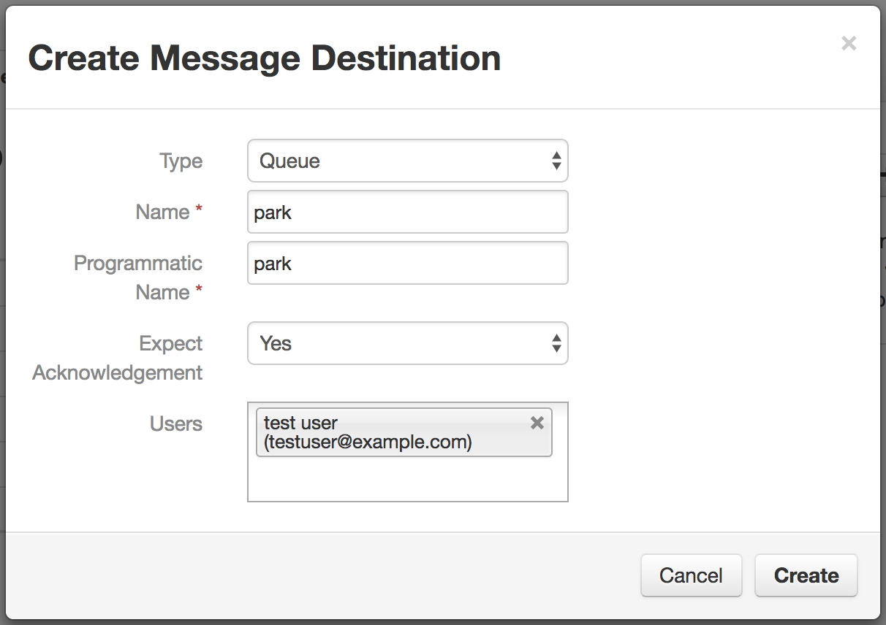
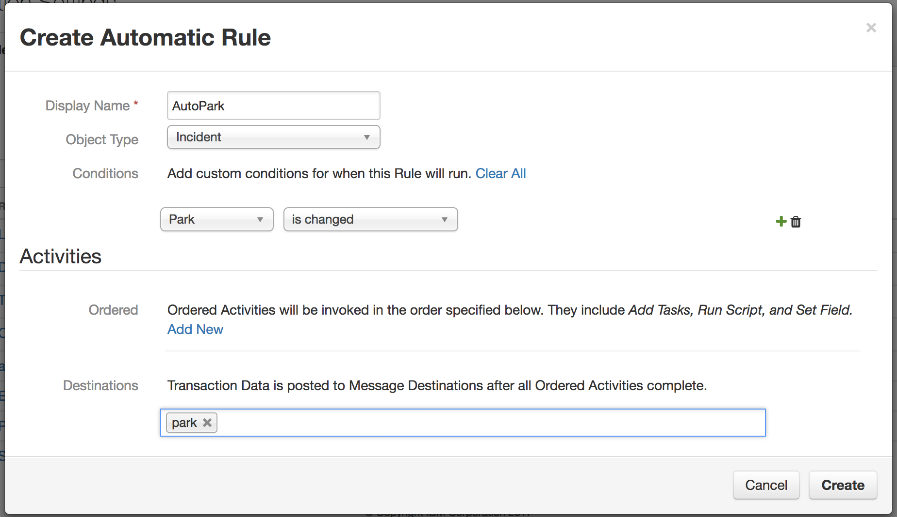

# Setup

This example uses three custom fields, and two custom actions.

### Custom Fields

Create a custom field with name "Park Name", API name "park_name", type Text.
This field will be updated to contain the full name of the selected park.

Create a custom field with name "Park Bears", API name "park_bears", type Text.
This field will be updated to show the types of bears in the park.

Create a custom field with name "Park", API name "park", type Select, with the
park codes as its options.  The easiest way to do this is to create the field
from the template JSON provided [here](fielddef_park.json), using the `gadget.py`
from the API examples (in python/examples/gadget/):

    python /path/to/gadget.py --email api@example.com --password password --org Local \
           --host resilient.example.com --port 443 \
           --post /types/incident/fields fielddef_park.json

Add these fields to your Details form.

### Rules

Add a message destination named `park`, type Queue.  Add the API user to the
destination's users list.

Add a Menu Item "Park" with object type Artifact, and add the destination
"park" to this rule.

Add an automatic action "AutoPark" with object type Incident, and add the
destination "park" to this action.  Add a condition so that this rule only runs 
when the value of the `park` field is changed:

### Running the Action Script

When the action script is run, it requests the Parks web service WSDL,
so you must start the parks service first.  Refer to the instructions in
[../service/README.md](../service/README.md).

Edit the 'park.config' with credentials and other values appropriate to your environment.

Then run the action script:

    python park.py

The action script will start, connect to the message queues, and wait for messages.
When an action is triggered, the action script shows a log like this:

    2015-07-30 12:03:59,136 Received action 18 for incident 2260: type=Incident; name=Bear Attack
    2015-07-30 12:03:59,136 Park code: BELA
    2015-07-30 12:03:59,205 (ParkData){
       parkCode = "BELA"
       parkName = "Bering Land Bridge National Preserve"
       geoLat = -164.4087917037424
       geoLong = 65.96080330575823
       hasBlackBear = False
       hasGrizzlyBear = True
       hasPolarBear = True
       url = "http://www.nps.gov/bela"
     }
    2015-07-30 12:03:59,205 Updated
