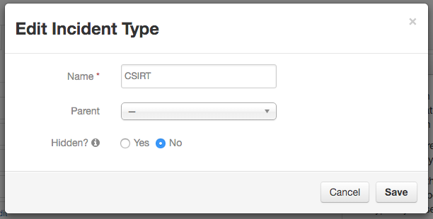

# Action handler for adding a group to an incident based on the addition of a specific incident type.
In this case an incident type of *CSIRT* is added, and a group *CSIRT* is created.  When the incident type is
added to a case, the action will check if the group is already a member (or owner) of the case and add the group 
if it is not.  

## Execution
```
python groupadd.py
```

## Configuration
The configuration is contained within *app.config*, to change which configuration file is loaded specify in the *APP_CONFIG_FILE* environment variable the full path to the filename e.g
```
export APP_CONFIG_FILE=/home/user/configuration.file
```
The example configuration file is kept in *Config/app.config*, and the *runit* shell script sets the environment

The configuration file is broken into sections as follows
### resilient
Connection information to the source org (used by the resilient_circuits module to connect to the source)
+ host = the hostname of the resilient server
+ port = 443 (always port 443)
+ email = Resilient user login (be sure that this user is not a SAML or Two Factor user, it also needs to have MasterAdministrator privileges in order to map enumerated field values)
+ password = the password for the resilient user
+ org = the name of the resilient org that will be the source of the record
+ stomp_port = 65001 (always 65001) Port for connecting to the Queue for the action module
+ logdir= fully qualified or relative path to the directory for the log file (app.log)
+ cafile= path to the file for the certificate for verification (used if a self signed certificate is used, or if the CA is not in your systems accepted CA list)
+ logfile= filename - defaults to app.log

### action
The destination queue for the action.  
+ queue= queue name configured in resilient

### actiondata
Configuration information for the action.  
+ group= name of the group to add
+ incidenttype= incident type to trigger the addition of membership.

## Resilient Configuration
The default configuration expects an action queue named *Group add on incident type*, and an automatic action for an incident named 
*group add*.  The automatic action should have have a condition of the Boolean field *csirt_action_required* being changed to Yes.
### Custom incident type definition

### Messaged Destination 

### Automatic Action

