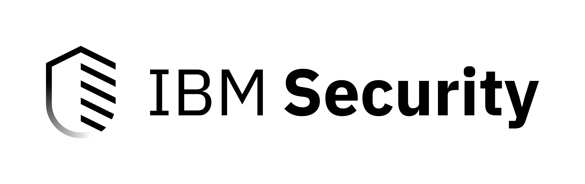

<!-- [[pypi_changelog]] -->

# IBM Resilient SDK


## Table of Contents

 * [Overview](#overview)
 * [Installation](#installation)
 * [Usage](#usage)
 * [Supported Python Versions](#supported-python-versions)
 * [Documentation](#documentation)
 * [License and Terms](#license-and-terms)


## Overview

The IBM Resilient SDK provides the tools and infrastructure you need to develop Resilient Apps, which you can then post on [App Exchange](https://exchange.xforce.ibmcloud.com/hub/?br=Resilient).

## Installation

To install the IBM Resilient SDK, simply execute the following command:

```
$ pip install resilient-sdk
```

## Usage

### `codegen:`
Generate boilerplate code to start developing an app.
```
$ resilient-sdk codegen -p <name_of_package> -m 'fn_custom_md' --rule 'Rule One' 'Rule Two'
```

### `docgen:`
Generate documentation for an app.
```
$ resilient-sdk docgen -p <path_to_package>
```

### `extract:`
Extract data in order to publish a .res file.
```
$ resilient-sdk extract -m 'fn_custom_md' --rule 'Rule One' 'Rule Two'
```

### `package:`
Package an integration into a Resilient app.
```
$ resilient-sdk package -p <path_to_directory> --display-name "My Custom app"
```

### `clone:`
Duplicate an existing Action related object (Function, Rule, Script, Message Destination, Workflow) with a new api or display name
```
$ resilient-sdk clone --workflow <workflow_to_be_cloned> <new_workflow_name>
```
```
$ resilient-sdk clone --workflow <workflow_to_be_cloned> <new_workflow_name> --changetype artifact
```

## Supported Python Versions

Python 2.7+ and Python 3.6+


## Documentation
For details on the Resilient SDK commands, use the `-h` option on the command line. For example, `resilient-sdk -h` and `resilient-sdk codegen -h`.

The Resilient App Developer's Guide provides information on using the Resilient SDK to develop and package apps. The guide is available on the IBM Knowledge Center at [ibm.biz/resilient-docs](https://ibm.biz/resilient-docs). On this web page, select your Resilient platform version. On the follow-on page, you can find the App Developer's Guide by expanding **Resilient Apps** in the Table of Contents pane.

## License and Terms

Copyright © IBM Corporation 2020

Permission is hereby granted, free of charge, to any person obtaining a copy
of this software and associated documentation files (the "Software"), to
deal in the Software without restriction, including without limitation the
rights to use, copy, modify, merge, publish, distribute, sublicense, and/or
sell copies of the Software, and to permit persons to whom the Software is
furnished to do so, subject to the following conditions:

The above copyright notice and this permission notice shall be included in
all copies or substantial portions of the Software.

THE SOFTWARE IS PROVIDED "AS IS", WITHOUT WARRANTY OF ANY KIND, EXPRESS OR
IMPLIED, INCLUDING BUT NOT LIMITED TO THE WARRANTIES OF MERCHANTABILITY,
FITNESS FOR A PARTICULAR PURPOSE AND NONINFRINGEMENT. IN NO EVENT SHALL THE
AUTHORS OR COPYRIGHT HOLDERS BE LIABLE FOR ANY CLAIM, DAMAGES OR OTHER
LIABILITY, WHETHER IN AN ACTION OF CONTRACT, TORT OR OTHERWISE, ARISING
FROM, OUT OF OR IN CONNECTION WITH THE SOFTWARE OR THE USE OR OTHER DEALINGS
IN THE SOFTWARE.